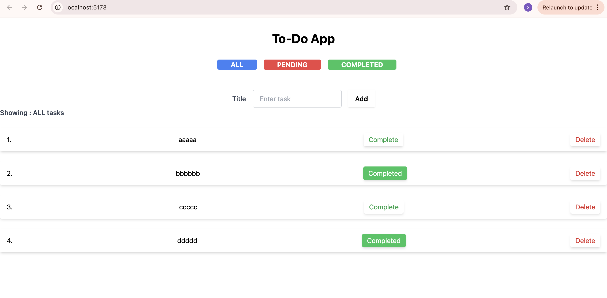
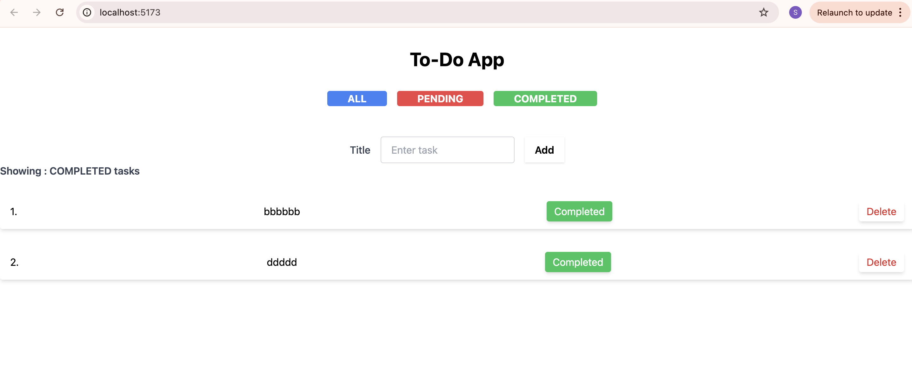
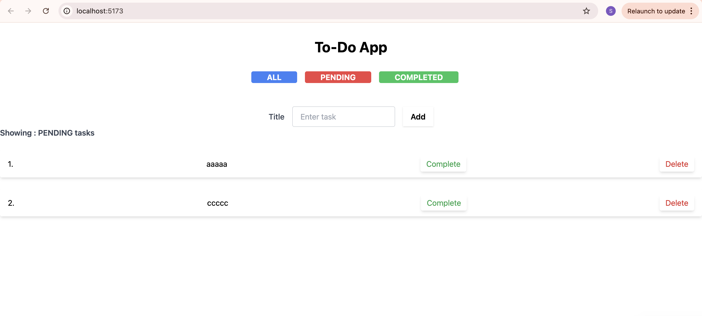

## To-Do List App

## A todo list making app built with React, with

#### - mark as complete and delete functionality.

#### - filter list with pending status(all, completed, done)

## Preview

### 🖥️ Screenshots

##### all tasks:



##### pending tasks:



##### completed tasks:



## 🚀 Setup Instructions

### 1. Clone the Repository

```bash
git clone https://github.com/swastijain13/React-todo-App.git
cd todo-app
```

### 2. Install Dependencies

```
npm install
```

### 3. Run Server

```
npm run dev
```

**App will run at http://localhost:5173**
